# 搭建企业微信机器人步骤

#### 第一步：要在企业微信上创建一个机器人（这个应该比较容易的）
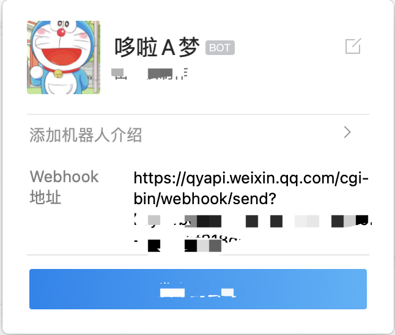

**注意：其中robotid是你需要推送的机器人id**

---

#### 第二步: 编写代码
按照 [企业微信官方文档](https://developer.work.weixin.qq.com/document/path/91770) 的代码规范来编写相应的代码, 文件名可以自定义，但是最终返回的格式一定要和官方文档保持一致

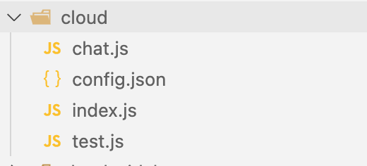

---
#### 第三步：需要在腾讯云管理后台创建一个云函数Node服务, 来存放代码

1. 新建一个云函数 `Hello World` 示例框架模板
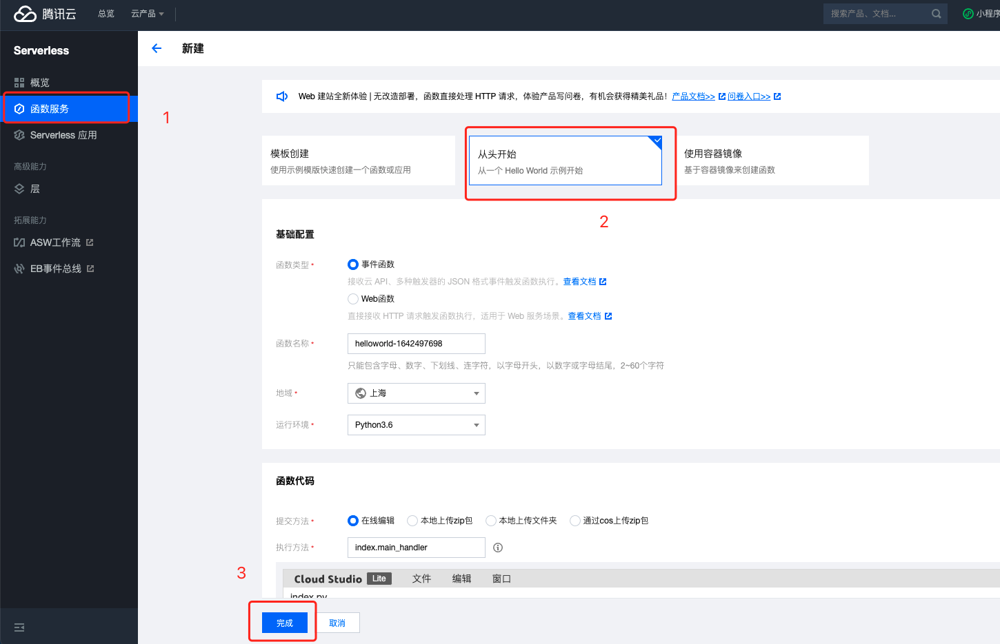

2. 将代码上传并进行部署
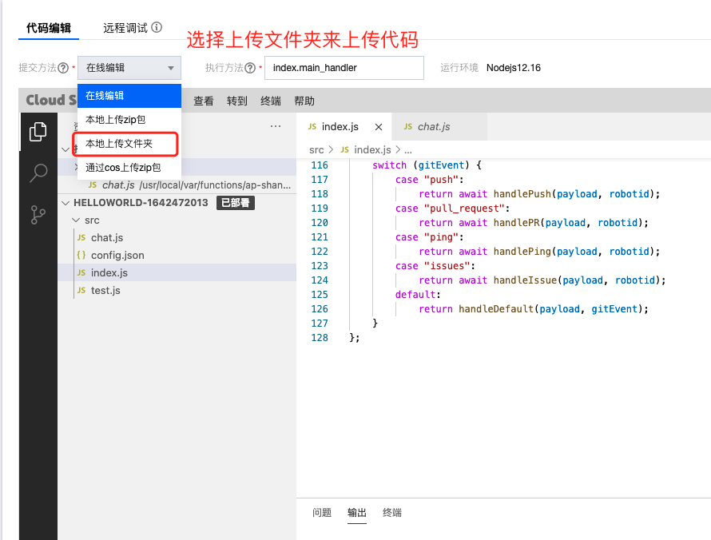
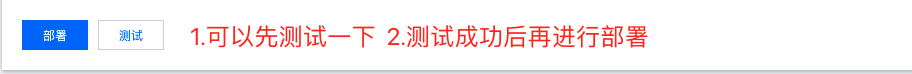

3. 点击函数名进入到触发管理菜单
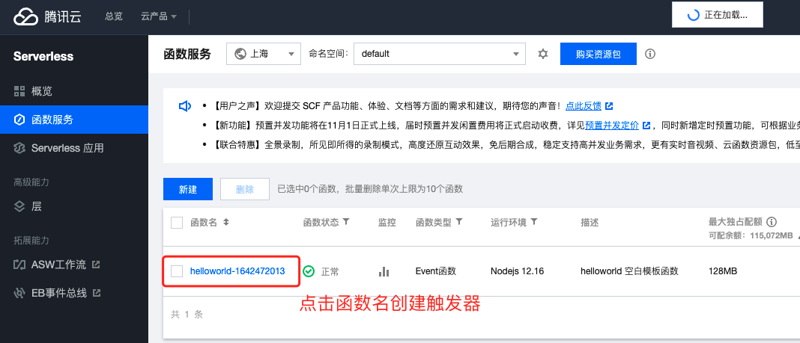

4. 创建触发器
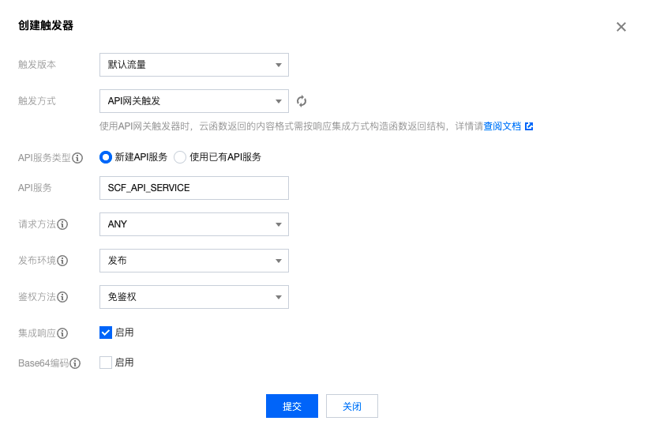
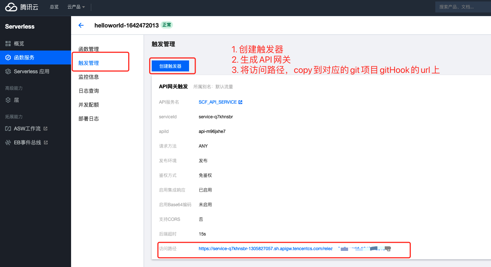

---
#### 第四步:
在github项目中的`Setting`中选择`Webhooks`，选择`Add Webhooks`，填写url, 此时的url就是腾讯云的访问路径。**注意：后面要加上id={robotId}**

**最后：** 我们尝试了提交一下代码，检查是否成功~

---

# 目前支持的功能
#### Push event示例
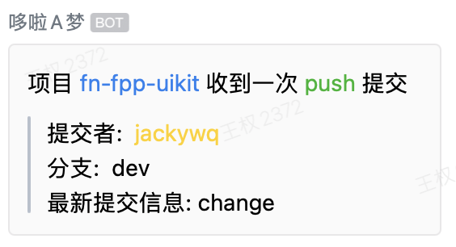

#### Issue event示例
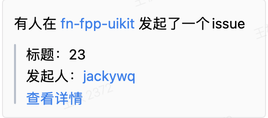

#### Pull Request event示例
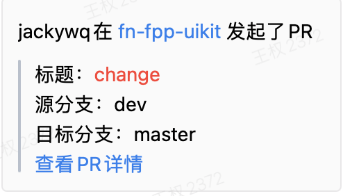

[参考 - 大佬github](https://github.com/LeoEatle/git-webhook-wework-robot)